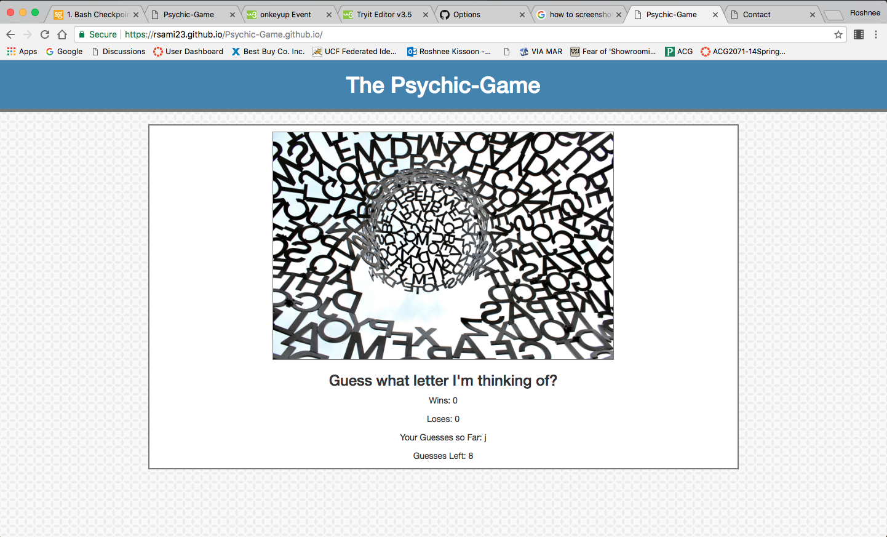

# Psychic-Game.github.io
Psychic Game made using JS

* What the project does?

1. The project is a game built in JavaScript that allows users to play a gae called Guess the letter.

2. The user has to guess the letter the computer is thinking of.

3. To get started just type a letter.

4. If the user gueses the right letter they get a point added to wins.

5. If the user guesses incorrectly its ok, the user gets 9 trys to guess the right letter.

6. If by the 9th try the user still hasnt guesses the right letter a loss a added to the loss score.

7. The game restarts on its own if the user wants to keeps playing. They dont have to anything but guess another letter. 

* How to get the project started?

1. Create the variables needed for the game.

2. Create an 'onkeyup' to get the game started.

3. Create a way for the computers guess to be created and stored.

4. Write out if and else if statements needed for everything in the game. 

5. Write out the inner html for the game. 
